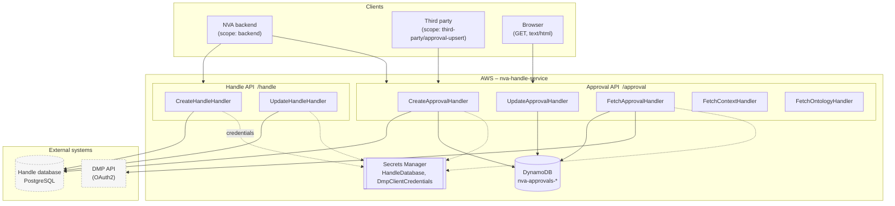

# nva-handle-service

AWS SAM application exposing two independent REST APIs for persistent identifiers in NVA.

| Module                             | API          | Responsibility                                                                                                      |
| ---------------------------------- | ------------ | ------------------------------------------------------------------------------------------------------------------- |
| [`handle`](handle/README.md)       | Handle API   | Creates and updates handles (persistent identifiers) for a URI in the external Handle database (PostgreSQL).        |
| [`approvals`](approvals/README.md) | Approval API | Manages approval records: links a set of named identifiers to a source URI and gives every approval its own handle. |

`approvals` uses `handle` as a library (`api(project(":handle"))`) to mint handles, but the two APIs are separate API
Gateways with their own base paths and their own authorization rules.

See the module READMEs for endpoints, diagrams and configuration:

- [Handle API](handle/README.md)
- [Approval API](approvals/README.md)

## System overview



Cognito authorizes all writing endpoints (POST/PUT). The reading endpoints in the Approval API are open. Every lambda
that talks to the Handle database runs inside a VPC with a static IP (see [Deploy](#deploy)).

## Build and test

```bash
./gradlew build                                  # build, test, checkstyle, PMD, spotless, spectral and coverage verification
./gradlew test                                   # tests only
./gradlew test --tests CreateHandleHandlerTest   # a single test class
./gradlew check                                  # static analysis
./gradlew jacocoTestReport                       # coverage report
```

Code quality requirements:

- 100 % METHOD and CLASS coverage, enforced by jacoco (`verifyCoverage`)
- Checkstyle (`config/checkstyle/checkstyle.xml`) and PMD (`config/pmd/ruleset.xml`)
- The OpenAPI files are linted with Spectral (`.spectral.yaml`)
- Tests tagged `RemoteTest`, `integrationTest` and `KarateTest` are excluded from the regular `test` run

Java 21 (Corretto) is provisioned by Gradle through the foojay toolchain resolver.

## Deploy

Locally you only need `./gradlew build`. Packaging and deployment happen in the pipeline: CodeBuild follows
[`buildspec.yaml`](buildspec.yaml), which runs `sam build` and `sam package` against [`template.yaml`](template.yaml)
and emits `packaged.yaml` for the CloudFormation deployment.

**Prerequisite:** the CloudFormation stack from `template_vpc_eid.yml` must already exist. The VPC configuration of this
service depends on it, because the lambdas talking to the Handle database need a static IP to get through the database
firewall.

The platform team opens the database firewall for that IP. The IP can be found in the AWS console under
**EC2 > Elastic IPs** — pick the one belonging to the stack created from `template_vpc_eid.yml`.

## Repository layout

```
handle/                    # Handle API + HandleDatabase (also used as a library by approvals) – see handle/README.md
approvals/                 # Approval API – see approvals/README.md
docs/
├── handle-openapi.yaml    # OpenAPI for the Handle API
└── approvals-openapi.yaml # OpenAPI for the Approval API
template.yaml              # SAM template: API Gateways, lambdas, DynamoDB, IAM
```

Both OpenAPI files are included directly into `template.yaml` as the `DefinitionBody` of their API Gateway, so they are
the source of truth for routing, request validation and authorization.
