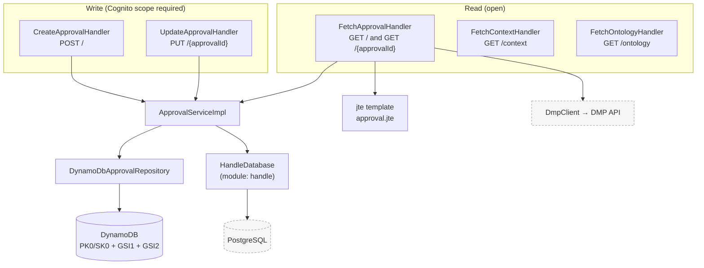
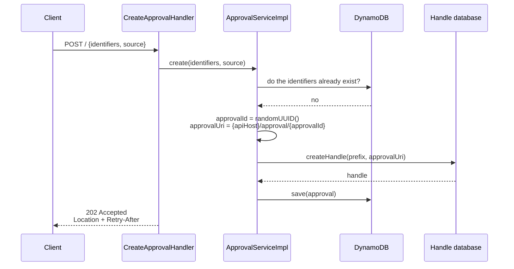
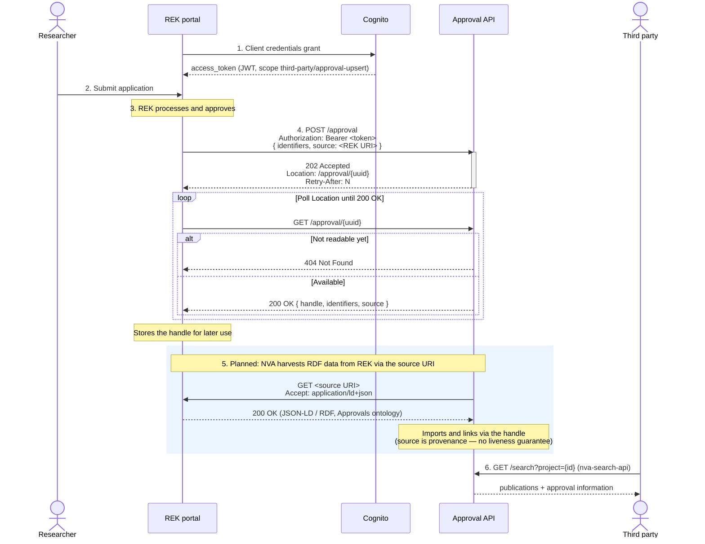

# Approval API

Manages approval records. An approval links a set of named identifiers (for example a REK case number and a DMP
identifier) to a source URI, and gets its own handle pointing back at the approval's URI in the NVA API. Approvals are
stored in DynamoDB; the handle is minted through the [`handle`](../handle/README.md) module.

Base path: `https://api.nva.unit.no/approval` (same shape for `api.test`, `api.sandbox` and `api.dev`).
Specification: [`docs/approvals-openapi.yaml`](../docs/approvals-openapi.yaml).

## Architecture



## Domain model

- **`Approval`** — `identifier` (UUID), `namedIdentifiers`, `source` (the source URI) and `handle`. All four are
  mandatory, and the identifier collection cannot be empty.
- **`NamedIdentifier`** — a name/value pair, for example `REK` / `2024/123`. Every identifier must be unique across all
  approvals; a collision returns `409 Conflict` with `conflictingKeys` in the problem response.
- **`Handle`** — a validated handle URI.
- **`IdentifierPolicy` / `IdentifierPolicyService`** — which identifier names a given customer is allowed to use. An
  unknown customer resolves to `IdentifierPolicy.DENY_ALL`. Currently domain-level only; not yet wired into the
  handlers.

## Create flow

`ApprovalServiceImpl.create` mints the handle synchronously before the approval is stored, so the approval is complete
by the time the `202` is returned:



`202 Accepted` with `Location` and `Retry-After` is the API contract rather than a description of the current
implementation: it lets the creation become genuinely asynchronous later without breaking clients. Clients should
therefore treat the `Location` URI as eventually available and poll it, but in practice it resolves on the first
attempt.

## End-to-end flow

How an approval registered in an external portal (here REK) travels through NVA. Steps 5 and 6 are **not** served by
this service — they are included to show where the approval ends up:



Corrections against the current implementation:

- The `handle` field is never `null` in a `200` response — an `Approval` cannot exist without a handle, so the poll
  loop should terminate on `200`, not on a non-null `handle`. Until the record is readable, `GET` returns `404`.
- Step 5 is not implemented here. Nothing in this service dereferences the `source` URI; `source` is stored purely as
  provenance. The only outbound enrichment that exists today is `DmpClient`, which fetches clinical trial data from the
  DMP API for identifiers named `DMP`, and only for the HTML representation.
- Step 6 is served by `nva-search-api`, not by this service.
- The auth server in step 1 is the NVA Cognito user pool. Third parties need the scope
  `https://api.nva.unit.no/scopes/third-party/approval-upsert`; internal backends use
  `https://api.nva.unit.no/scopes/backend`.

## Reading approvals

- `FetchApprovalHandler` serves both `GET /{approvalId}` and `GET /?handle=…` / `GET /?name=…&value=…`. Mixing a path
  parameter with query parameters returns `400 Bad Request`.
- Content negotiation: `text/html` (jte template `approval.jte`), `application/ld+json` and `application/json`. With no
  `Accept` header the response is `application/json`.
- For identifiers named `DMP`, the HTML view is enriched with clinical trial data from the DMP API through `DmpClient`
  (OAuth2 client credentials, secrets in `DmpClientCredentials`). The JSON and JSON-LD representations are not enriched.
- `GET /context` and `GET /ontology` serve the JSON-LD context and the RDF ontology (Turtle) for the API.

## Persistence

A single DynamoDB table with `PK0`/`SK0` plus two global secondary indexes (`GSI1`, `GSI2`), giving lookup by handle and
by named identifier in addition to lookup by approval id. Point-in-time recovery is enabled and the table is tagged for
backup.

## Endpoints

| Method | Path            | OperationId          | Scope                                                        | Success | Description                                             |
| ------ | --------------- | -------------------- | ------------------------------------------------------------ | ------- | ------------------------------------------------------- |
| POST   | `/`             | `createApproval`     | `…/scopes/third-party/approval-upsert` or `…/scopes/backend` | `202`   | Create an approval with identifiers and a source URI    |
| GET    | `/`             | `getApprovalByQuery` | open                                                         | `200`   | Look up an approval by `?handle=` or `?name=`&`?value=` |
| GET    | `/{approvalId}` | `getApprovalById`    | open                                                         | `200`   | Fetch an approval by id (html, json or ld+json)         |
| PUT    | `/{approvalId}` | `updateApproval`     | `…/scopes/third-party/approval-upsert` or `…/scopes/backend` | `202`   | Replace the identifiers on an approval                  |
| GET    | `/context`      | `getContext`         | open                                                         | `200`   | JSON-LD context                                         |
| GET    | `/ontology`     | `getOntology`        | open                                                         | `200`   | RDF ontology (Turtle)                                   |

Error codes: `400`, `401` (missing or invalid token), `403` (missing scope), `404`, `409` (identifier already in use,
with `conflictingKeys`), `502`.

Query parameters on `GET /` must be URL-encoded, and you supply either `handle` or both `name` and `value`:

```
GET /approval?handle=https%3A%2F%2Fhdl.handle.net%2F11250.1%2F12345
GET /approval?name=REK&value=2024%2F123
```

Request body for `POST /`:

```json
{
  "type": "Approval",
  "identifiers": [
    { "type": "Identifier", "name": "REK", "value": "2024/123" },
    { "type": "Identifier", "name": "DMP", "value": "dmp-456" }
  ],
  "source": "https://example.com/source/12345"
}
```

`PUT /{approvalId}` takes the same structure, but with `identifiers` only.

Response body:

```json
{
  "@context": "https://api.nva.unit.no/approval/context",
  "type": "Approval",
  "id": "https://api.nva.unit.no/approval/6ff5f1b5-97c1-40f0-86ad-2cbd9006eee2",
  "identifier": "6ff5f1b5-97c1-40f0-86ad-2cbd9006eee2",
  "identifiers": [{ "type": "Identifier", "name": "REK", "value": "2024/123" }],
  "source": "https://example.com/source/12345",
  "handle": "https://hdl.handle.net/11250.1/98765"
}
```

## Configuration

Environment variables, set in [`template.yaml`](../template.yaml):

| Variable                      | Used by               | Description                                                                   |
| ----------------------------- | --------------------- | ----------------------------------------------------------------------------- |
| `TABLE`                       | all                   | DynamoDB table name                                                           |
| `API_HOST`                    | all                   | API domain, used to build approval URIs                                       |
| `HANDLE_PREFIX`               | create, update, fetch | Handle prefix — `20.500.14886` in production, otherwise `11250.1`             |
| `HANDLE_BASE_URI`             | create, update, fetch | Host part of handle URIs (`https://hdl.handle.net`)                           |
| `HANDLE_DATABASE_SECRET_NAME` | create, update, fetch | Secrets Manager secret holding Handle database credentials (`HandleDatabase`) |
| `DMP_CLIENT_SECRET_NAME`      | fetch                 | Secret holding OAuth2 credentials for the DMP API (`DmpClientCredentials`)    |
| `APPLICATION_DOMAIN`          | fetch                 | Domain used in the HTML view                                                  |
| `COGNITO_AUTHORIZER_URLS`     | all                   | Cognito issuers                                                               |
| `ALLOWED_ORIGIN`              | all                   | CORS                                                                          |

`CreateApprovalFunction` and `UpdateApprovalFunction` run inside the VPC with a static IP because they reach the Handle
database; `FetchApprovalFunction`, `FetchContextFunction` and `FetchOntologyFunction` do not.

## Module layout

```
src/main/
├── java/no/sikt/nva/approvals/
│   ├── domain/        # Approval, NamedIdentifier, Handle, IdentifierPolicy, ApprovalService(+Impl)
│   ├── persistence/   # ApprovalRepository, DynamoDbApprovalRepository, DAOs, query objects
│   ├── rest/          # Create/Update/Fetch handlers, request and response models, ApprovalHtmlModel
│   ├── dmp/           # DmpClient, OAuth2TokenService and clinical trial models
│   └── utils/         # RequestUtils, ValidationUtils
└── resources/jte/     # HTML templates (approval.jte)
```
