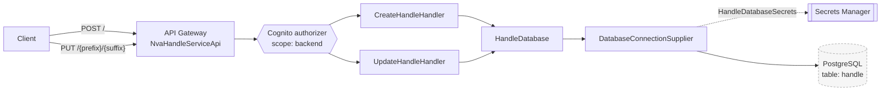

# Handle API

Creates and updates handles — persistent identifiers — for a URI. This module (package `no.sikt.nva.handle`) writes
directly to the external Handle database over JDBC, and is also used as a library by the
[Approval API](../approvals/README.md).

Base path: `https://api.nva.unit.no/handle` (same shape for `api.test`, `api.sandbox` and `api.dev`).
Specification: [`docs/handle-openapi.yaml`](../docs/handle-openapi.yaml).

## Architecture



Both lambdas run inside a VPC with a static IP, because the Handle database firewall whitelists that IP. See
[Deploy](../README.md#deploy) in the root README.

## Key classes

- **`CreateHandleHandler`** — `POST /`. Two modes:
  - _default_: only `uri` in the body; the handle is generated using the configured `HANDLE_PREFIX`
  - _import_: `uri` + `prefix` + `suffix` in the body, for handles imported from other systems. Returns
    `409 Conflict` (`HandleAlreadyExistException`) if the handle already exists.
- **`UpdateHandleHandler`** — `PUT /{prefix}/{suffix}`, sets a new `uri` on an existing handle.
- **`HandleDatabase`** — all SQL. Idempotent in default mode: if the same URI already exists within the same prefix, the
  existing handle is reused instead of minting a new one. The suffix is derived from the `handle_id` generated by the
  database, and the transaction is committed or rolled back explicitly.
- **`DatabaseConnectionSupplier`** — builds the JDBC connection from `HandleDatabaseSecrets` in Secrets Manager.

## Endpoints

| Method | Path                 | OperationId    | Scope                                    | Success | Description                                   |
| ------ | -------------------- | -------------- | ---------------------------------------- | ------- | --------------------------------------------- |
| POST   | `/`                  | `createHandle` | `https://api.nva.unit.no/scopes/backend` | `201`   | Create a handle for a URI (default or import) |
| PUT    | `/{prefix}/{suffix}` | `updateHandle` | `https://api.nva.unit.no/scopes/backend` | `200`   | Set a new URI on an existing handle           |

Error codes: `400` (invalid request), `409` (handle already exists, import mode only), `502` (Handle database failure).

Request body — `uri` is required, `prefix` and `suffix` are only used for import:

```json
{
  "uri": "https://example.com/resource/1",
  "prefix": "11250.1",
  "suffix": "12345"
}
```

Response body:

```json
{
  "handle": "https://hdl.handle.net/11250.1/12345"
}
```

## Configuration

Environment variables, set in [`template.yaml`](../template.yaml):

| Variable                      | Description                                                                        |
| ----------------------------- | ---------------------------------------------------------------------------------- |
| `HANDLE_PREFIX`               | Prefix used for generated handles (`11250.1`)                                      |
| `HANDLE_BASE_URI`             | Host part of handle URIs (`https://hdl.handle.net`)                                |
| `HANDLE_DATABASE_SECRET_NAME` | Name of the Secrets Manager secret holding database credentials (`HandleDatabase`) |
| `ALLOWED_ORIGIN`              | CORS                                                                               |
| `COGNITO_AUTHORIZER_URLS`     | Cognito issuers                                                                    |

## Module layout

```
src/main/java/no/sikt/nva/handle/
├── CreateHandleHandler.java
├── UpdateHandleHandler.java
├── HandleDatabase.java
├── exceptions/                          # CreateHandleException, UpdateHandleException,
│                                        # HandleAlreadyExistException, MalformedRequestException
├── model/                               # HandleRequest, HandleResponse, HandleDatabaseSecrets
└── utils/DatabaseConnectionSupplier.java
```
